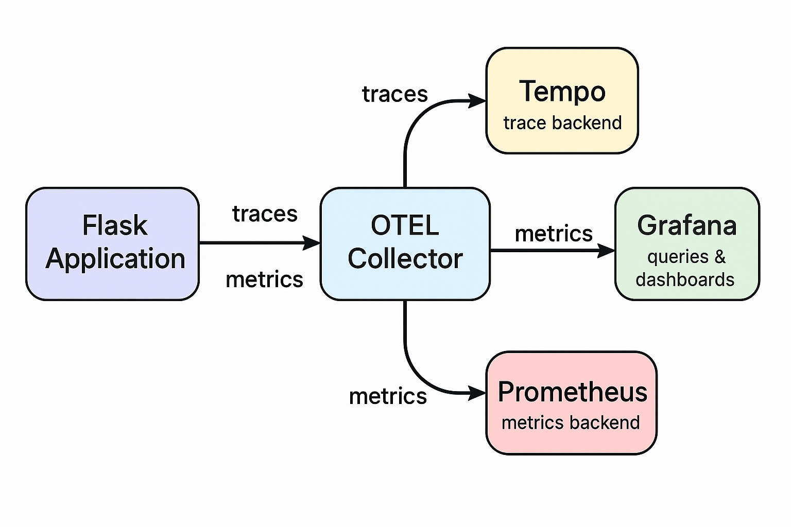

3-Tier Student Registration Web Application
This project is a classic 3-tier web application designed for student registration. It demonstrates a full-stack development workflow, including a frontend interface, a backend API, a relational database, automated testing, and observability with logging and tracing.

Architecture
The application is built using a decoupled 3-tier architecture, which separates concerns and improves scalability.

Presentation Tier (Frontend): A clean, responsive user interface built with HTML, Tailwind CSS, and vanilla JavaScript. This is what the user interacts with.

Logic Tier (Backend): A robust REST API built with Python and the Flask web framework. It handles business logic, validation, and communication with the database.

Data Tier (Database): A MySQL relational database to persistently store student registration data.

Features
Student Registration: A simple form to register new students with their first name, last name, and email.

Automated Backend Testing: Unit tests for the API endpoints using the pytest framework.

Observability: Integrated OpenTelemetry for structured logging and request tracing, providing deep insights into the application's behavior.

Local Version Control: The project is set up with a local Git repository to track all changes.

Project Structure
The project is organized into distinct folders for each tier, promoting a clean and maintainable codebase.

student-registration-app/
├── backend/
│   ├── venv/               # Python virtual environment
│   ├── main.py             # Main Flask application with logging/tracing
│   ├── test_app.py         # Pytest test file for the API
│   └── requirements.txt    # Python dependencies
│
├── database/
│   └── schema.sql          # SQL script to create the database and table
│
├── frontend/
│   └── index.html          # The HTML frontend interface
│
├── .gitignore              # Specifies files for Git to ignore
└── README.md               # Project documentation (this file)

Prerequisites
Before you begin, ensure you have the following installed on your local machine:

Python 3.8+

MySQL Server (including MySQL Workbench)

Visual Studio Code

Python Extension

Live Server Extension

Git

Setup and Installation Guide
Follow these steps to get the application running on your local machine.

1. Set Up the Database
Open MySQL Workbench and connect to your local MySQL server.

Go to File > Open SQL Script... and select the database/schema.sql file.

Execute the script by clicking the lightning bolt (⚡) icon. This will create the student_registration_db database and the students table.

2. Configure the Backend
Open a terminal in the project's root directory (student-registration-app/).

Navigate to the backend folder:

cd backend

Create and activate a Python virtual environment:

# Create the virtual environment
python -m venv venv

# Activate it (on Windows)
.\venv\Scripts\activate

Install the required Python packages:

pip install -r requirements.txt

Crucially, open backend/main.py and update the DB_CONFIG dictionary with your MySQL username and password.

3. Run the Application
You will need two terminals running simultaneously.

Terminal 1: Start the Backend Server
Ensure you are in the backend directory with your venv activated.

Run the Flask application:

python main.py

The server will start on http://localhost:5000. You will see OpenTelemetry logs and traces in this terminal. Leave this terminal running.

Terminal 2 (or VS Code UI): Launch the Frontend
In the VS Code file explorer, navigate to the frontend folder.

Right-click on index.html.

Select "Open with Live Server".

Your default browser will open with the registration form, and the application is now fully functional.

Running the Tests
To ensure the backend API is working correctly, you can run the automated tests.

Open a new terminal and navigate to the backend directory.

Activate the virtual environment (.\venv\Scripts\activate).

Run pytest:

pytest

The tests will execute, and you will see the results in the terminal.

Local Version Control with Git
This project is configured as a local Git repository.

To see the status of your changes:

git status

To save your work (commit process):

# 1. Stage all your changes for the next commit
git add .

# 2. Save the staged changes with a descriptive message
git commit -m "Your descriptive message here"

Observability & Tracing

The service uses OpenTelemetry to provide detailed observability and tracing capabilities:

Middleware spans: Every HTTP request is automatically traced by middleware, capturing method, URL, status, and duration.

Endpoint spans: Each Flask endpoint (home_handler, register_student_handler) creates its own child span to isolate endpoint-specific logic.

Database spans: Each database operation (create_db_connection, db_insert_student) is a child span of the endpoint span, providing granular visibility into database performance and latency.

Structured span attributes:

HTTP spans: http.method, http.url, http.status_code, http.duration_ms

Database spans: db.system, db.user, db.name, db.statement

Request-specific data: request.body

Error and exception tracking: All exceptions are recorded within spans using record_exception, making errors visible in tracing backends.

Trace hierarchy: The nested structure of spans allows you to see the full lifecycle of a request:

HTTP POST /register  (top-level HTTP span)
│
├── register_student_handler  (endpoint span)
│   ├── create_db_connection  (DB connection span)
│   └── db_insert_student     (DB insert span)
└── Response sent

Correlation with logs: Logs include trace and span IDs, allowing you to correlate application logs with traces for full observability.

Exportable to observability backends: By replacing the ConsoleSpanExporter with OTLP exporters, traces can be sent to Jaeger, Tempo, or any OpenTelemetry-compatible backend for visualization and analysis.

This observability setup helps in:

Identifying performance bottlenecks (e.g., slow DB queries).

Understanding request flow and latency across services.

Detecting and diagnosing errors effectively.

Logging

Logs are structured JSON, including trace context, timestamp, and severity.

Example log fields:

body (log message)

severity_text (INFO/WARN/ERROR)

trace_id and span_id

resource attributes (service.name)

Notes

Currently uses Flask development server; use a production WSGI server for production deployments.

OpenTelemetry console exporter is used for demonstration; configure OTLP exporters for real observability backends.

The service uses OpenTelemetry to provide detailed observability and tracing capabilities:

Middleware spans: Every HTTP request is automatically traced by middleware, capturing method, URL, status, and duration.

Endpoint spans: Each Flask endpoint (home_handler, register_student_handler) creates its own child span to isolate endpoint-specific logic.

Database spans: Each database operation (create_db_connection, db_insert_student) is a child span of the endpoint span, providing granular visibility into database performance and latency.

Structured span attributes:

HTTP spans: http.method, http.url, http.status_code, http.duration_ms

Database spans: db.system, db.user, db.name, db.statement

Request-specific data: request.body

Error and exception tracking: All exceptions are recorded within spans using record_exception, making errors visible in tracing backends.

Trace hierarchy: The nested structure of spans allows you to see the full lifecycle of a request:

HTTP POST /register  (top-level HTTP span)
│
├── register_student_handler  (endpoint span)
│   ├── create_db_connection  (DB connection span)
│   └── db_insert_student     (DB insert span)
└── Response sent

Correlation with logs: Logs include trace and span IDs, allowing you to correlate application logs with traces for full observability.

Exportable to observability backends: By replacing the ConsoleSpanExporter with OTLP exporters, traces can be sent to Jaeger, Tempo, or any OpenTelemetry-compatible backend for visualization and analysis.

This observability setup helps in:

Identifying performance bottlenecks (e.g., slow DB queries).

Understanding request flow and latency across services.

Detecting and diagnosing errors effectively.

Logging

Logs are structured JSON, including trace context, timestamp, and severity.

Example log fields:

body (log message)

severity_text (INFO/WARN/ERROR)

trace_id and span_id

resource attributes (service.name)

Notes

Currently uses Flask development server; use a production WSGI server for production deployments.

OpenTelemetry console exporter is used for demonstration; configure OTLP exporters for real observability backends.

New Project structure

student-registration-app/
├── backend/
│   ├── venv/               
│   ├── main.py             # Flask app with tracing
│   ├── test_app.py         
│   └── requirements.txt    
│
├── database/
│   └── schema.sql          
│
├── frontend/
│   └── index.html          
│
├── infra/                  # Infrastructure configs for observability
│   ├── otel-collector-config.yaml   # OpenTelemetry Collector config
│   ├── prometheus.yml               # Prometheus scrape config
│   ├── tempo.yaml                   # Tempo tracing backend config
│   └── docker-compose.yml           # Orchestrates Collector, Prometheus, Tempo, Grafana
│
├── .gitignore              
└── README.md     


Student Registration App

A full-stack Python Flask student registration app with observability using OpenTelemetry, Prometheus, Tempo, and Grafana.

📂 Project Structure
student-registration-app/
├── backend/
│   ├── venv/               
│   ├── main.py             # Flask app with tracing & metrics
│   ├── test_app.py         
│   └── requirements.txt    
│
├── database/
│   └── schema.sql          
│
├── frontend/
│   └── index.html          
│
├── infra/                  # Infrastructure configs
│   ├── otel-collector-config.yaml   # OpenTelemetry Collector config
│   ├── prometheus.yml               # Prometheus scrape config
│   ├── tempo.yaml                   # Tempo tracing backend config
│   ├── docker-compose.yml           # Spin up Collector, Prometheus, Tempo, Grafana
│   └── provisioning/                # Grafana data source provisioning
│       └── datasources/datasources.yaml
│
├── .gitignore              
└── README.md               

⚡ Observability Stack

The stack includes:

OpenTelemetry Collector – receives traces & metrics from Flask app.

Tempo – stores traces.

Prometheus – scrapes metrics from Collector.

Grafana – visualizes traces and metrics. Auto-configured via provisioning.

🔧 Setup Instructions
1. Backend Dependencies
cd backend
python -m venv venv
venv\Scripts\activate    # Windows
pip install -r requirements.txt


Ensure your main.py has:

OTLP exporter to Collector

/metrics endpoint using prometheus_client

2. Infra Files

Place these in infra/:

otel-collector-config.yaml – Collector config (traces → Tempo, metrics → Prometheus).

prometheus.yml – Prometheus scrape config.

tempo.yaml – Tempo local storage config.

docker-compose.yml – Orchestrates Collector, Prometheus, Tempo, Grafana.

provisioning/datasources/datasources.yaml – Grafana auto connects to Prometheus + Tempo.

⚠️ Make sure files are .yaml (not .txt).

3. Run Observability Stack
cd infra
docker-compose up


Grafana → http://localhost:3000
 (admin/admin)

Prometheus → http://localhost:9090

Tempo → http://localhost:3200

Collector OTLP gRPC → 4317 / HTTP → 4318

4. Generate Data

Test your Flask API:

curl -X POST http://localhost:5000/register \
  -H "Content-Type: application/json" \
  -d '{"first_name": "John", "last_name": "Doe", "email": "john@example.com"}'


Generates traces in Tempo

Updates metrics in Prometheus (http_requests_total, http_request_latency_seconds)

5. View Traces in Grafana

Open Grafana → Explore → Tempo

Query:

service.name = "student-registration-service"


Optional filters:

service.name = "student-registration-service" AND span.name = "register_student_handler"
service.name = "student-registration-service" AND attributes.http.method = "POST"
service.name = "student-registration-service" AND attributes.http.status_code = 201


Click on a trace to view spans:

register_student_request

create_db_connection

db_insert_student

6. View Metrics in Grafana

Open Grafana → Explore → Prometheus

Example queries:

# Total requests per endpoint
http_requests_total

# Requests per minute for /register
sum(rate(http_requests_total{endpoint="/register"}[1m])) by (endpoint)

# Request latency histogram
http_request_latency_seconds_bucket


Combine metrics & traces in Grafana dashboards.

7. Logs

Logs are available in Docker:

docker-compose logs -f backend
docker-compose logs -f otel-collector


Optional: Forward logs to Grafana Loki for unified log + metrics + trace view.

8. Tips

For faster Prometheus updates, reduce scrape_interval to 1s.

Trace visibility appears ~1–2 seconds after request.

Metrics updates appear after Prometheus scrapes (~5 seconds by default).

This README now provides full instructions for setting up your project with both traces and metrics ready for Grafana visualization.

I can also include a ready-to-import Grafana dashboard JSON that shows:

Request rate

Latency

Success/failure counts

Trace breakdown

Do you want me to create that next?

You said:
yes
ChatGPT said:

Perfect! Let’s create a ready-to-import Grafana dashboard JSON tailored for your student registration app, showing traces, metrics, latency, and errors. You can import this directly into Grafana.

1️⃣ Dashboard Overview

Title: Student Registration Observability

Panels:

Request Rate (Prometheus) – http_requests_total per endpoint

Request Latency (Histogram) – http_request_latency_seconds

Error Count (Prometheus) – HTTP 5xx errors

Traces (Tempo) – list of traces for /register

Trace Duration (Tempo) – latency per trace

2️⃣ Grafana Dashboard JSON
{
  "dashboard": {
    "id": null,
    "uid": "student-registration-dashboard",
    "title": "Student Registration Observability",
    "timezone": "browser",
    "schemaVersion": 37,
    "version": 1,
    "panels": [
      {
        "type": "graph",
        "title": "Request Rate per Endpoint",
        "targets": [
          {
            "expr": "sum(rate(http_requests_total[1m])) by (endpoint)",
            "legendFormat": "{{endpoint}}",
            "refId": "A",
            "datasource": "Prometheus"
          }
        ],
        "gridPos": {"x": 0,"y": 0,"w": 12,"h": 6}
      },
      {
        "type": "graph",
        "title": "Request Latency (Histogram)",
        "targets": [
          {
            "expr": "histogram_quantile(0.95, sum(rate(http_request_latency_seconds_bucket[1m])) by (le, endpoint))",
            "legendFormat": "{{endpoint}}",
            "refId": "B",
            "datasource": "Prometheus"
          }
        ],
        "gridPos": {"x": 12,"y": 0,"w": 12,"h": 6}
      },
      {
        "type": "graph",
        "title": "Error Count (HTTP 5xx)",
        "targets": [
          {
            "expr": "sum(rate(http_requests_total{http_status=~\"5..\"}[1m])) by (endpoint)",
            "legendFormat": "{{endpoint}}",
            "refId": "C",
            "datasource": "Prometheus"
          }
        ],
        "gridPos": {"x": 0,"y": 6,"w": 12,"h": 6}
      },
      {
        "type": "trace",
        "title": "Traces for /register",
        "targets": [
          {
            "query": "service.name = \"student-registration-service\" AND attributes.http.method = \"POST\"",
            "refId": "D",
            "datasource": "Tempo"
          }
        ],
        "gridPos": {"x": 12,"y": 6,"w": 12,"h": 6}
      },
      {
        "type": "trace",
        "title": "Trace Duration",
        "targets": [
          {
            "query": "service.name = \"student-registration-service\" AND span.name = \"register_student_handler\"",
            "refId": "E",
            "datasource": "Tempo"
          }
        ],
        "gridPos": {"x": 0,"y": 12,"w": 24,"h": 6}
      }
    ]
  },
  "overwrite": true
}

3️⃣ How to Import in Grafana

Open Grafana → Dashboards → Import → Upload JSON

Paste the JSON above.

Select your data sources:

Prometheus → metrics panels

Tempo → traces panels

Click Import.

4️⃣ What You’ll See

Top left: Requests per minute per endpoint

Top right: 95th percentile latency

Middle left: Error count (HTTP 5xx)

Middle right: Trace list for /register

Bottom: Detailed trace duration for register_student_handler

This dashboard gives end-to-end visibility: metrics + traces in one place.

I can also make a ready-to-use .json file you can drop directly in infra/provisioning/dashboards/ so Grafana auto-imports it.

Do you want me to do that?

Student Registration App

This project demonstrates a full-stack student registration system with Flask backend, MySQL database, and Prometheus + OpenTelemetry observability.

Project Structure
student-registration-app/
├── backend/
│   ├── venv/               # Python virtual environment
│   ├── main.py             # Flask app with logging, tracing, and metrics
│   ├── test_app.py         # Pytest tests for the API
│   └── requirements.txt    # Python dependencies
│
├── database/
│   └── schema.sql          # SQL script to create database/table
│
├── frontend/
│   └── index.html          # HTML frontend interface
│
├── infra/
│   ├── docker-compose.yml  # Grafana, Prometheus, Tempo, OTEL Collector
│   ├── otel-collector-config.yaml
│   └── prometheus.yml
│
├── .gitignore
└── README.md

Prerequisites

Python 3.11+

Docker & Docker Compose

MySQL server running locally

Backend Setup

Create virtual environment and activate it:

cd backend
python -m venv venv
.\venv\Scripts\activate


Install dependencies:

pip install -r requirements.txt


Run Flask backend:

python main.py


App runs on: http://localhost:5000

Health check: GET /

Register student: POST /register with JSON:

{
    "first_name": "John",
    "last_name": "Doe",
    "email": "john.doe@example.com"
}

Observability & Tracing
Traces

OpenTelemetry configured in main.py:

Sends traces via OTLP gRPC (localhost:14317) and OTLP HTTP (localhost:14318/v1/traces)

Example spans:

register_student_request for student registration

home_request for health check

Metrics

Prometheus metrics exposed at:

http://localhost:8000/metrics


Includes counters like student_registration_requests_total (increments per registration request)

Infrastructure

The infra/ folder contains Docker Compose for observability stack:

Grafana – visualize metrics & traces

Prometheus – scrape metrics from Flask

Tempo – store distributed traces

OTEL Collector – receive traces from backend and forward to Tempo

Start infrastructure
cd infra
docker-compose up -d


Grafana: http://localhost:3000

Default credentials: admin / admin

Prometheus: http://localhost:9090

Tempo: http://localhost:3200

How to Use
1. Test the API

Health check:

curl http://localhost:5000/


Register a student:

curl -X POST http://localhost:5000/register \
  -H "Content-Type: application/json" \
  -d '{"first_name":"Jane","last_name":"Doe","email":"jane.doe@example.com"}'

2. View Metrics

Open Prometheus metrics endpoint:

http://localhost:8000/metrics


You should see counters like student_registration_requests_total.

Query metrics in Grafana using Prometheus data source:

Example: sum(student_registration_requests_total) by (method)

3. View Traces

Open Grafana → Tempo data source

Search for traces by:

Endpoint names: /register or /

Or attributes like http.method="POST"

4. Dashboard

Import Grafana dashboards for:

Student registration request counts

Latency and error traces from Tempo

Metrics auto-update as requests happen

Notes

Metrics and traces are end-to-end: API → Flask → DB → OTEL Collector → Tempo/Prometheus → Grafana

Prometheus scrapes /metrics every 15s by default

Ensure no port conflicts: 5000, 8000, 3000, 9090, 3200, 14317, 14318

Use docker-compose down to stop all infrastructure containers

Here’s an example Grafana dashboard JSON you can import directly to visualize student registration metrics and traces from your setup (Prometheus + Tempo):

Save this as student-registration-dashboard.json and import it in Grafana via “Manage → Import → Upload JSON”.

{
  "id": null,
  "uid": "student-registration",
  "title": "Student Registration Monitoring",
  "timezone": "browser",
  "schemaVersion": 36,
  "version": 1,
  "panels": [
    {
      "type": "graph",
      "title": "Student Registrations Over Time",
      "gridPos": {"x":0,"y":0,"w":12,"h":6},
      "targets": [
        {
          "expr": "sum(student_registration_requests_total) by (http_method)",
          "legendFormat": "{{http_method}}",
          "refId": "A",
          "datasource": "Prometheus"
        }
      ],
      "yaxes": [
        {"format":"short","label":"Requests","logBase":1,"min":0},
        {"format":"short","show":false}
      ]
    },
    {
      "type": "graph",
      "title": "Student Registration Errors",
      "gridPos": {"x":0,"y":6,"w":12,"h":6},
      "targets": [
        {
          "expr": "sum(student_registration_errors_total) by (http_method)",
          "legendFormat": "{{http_method}}",
          "refId": "B",
          "datasource": "Prometheus"
        }
      ],
      "yaxes": [
        {"format":"short","label":"Errors","logBase":1,"min":0},
        {"format":"short","show":false}
      ]
    },
    {
      "type": "trace",
      "title": "Student Registration Traces",
      "gridPos": {"x":12,"y":0,"w":12,"h":12},
      "targets": [
        {
          "refId": "C",
          "datasource": "Tempo",
          "query": "",
          "filters": [
            {"key":"http.target","operator":"=","value":"/register"}
          ]
        }
      ]
    }
  ]
}

✅ How it works:

Panel 1: Student Registrations Over Time

Plots total registration requests, grouped by HTTP method (POST, etc.)

Prometheus metric: student_registration_requests_total

Panel 2: Student Registration Errors

Shows failed registration attempts

Prometheus metric: student_registration_errors_total

Panel 3: Traces

Displays Tempo traces filtered for /register endpoint

Shows end-to-end latency and spans

How to Import in Grafana

Open Grafana: http://localhost:3000

Login: admin / admin

Go to Dashboards → Manage → Import

Upload the JSON file

Select Prometheus as the metrics datasource and Tempo as the traces datasource

Click Import → Dashboard is ready

Perfect! Here’s a full README.md tailored to your project with tracing, metrics, and Grafana setup, ready for copy-paste:

# Student Registration App

A simple student registration API with **Flask**, **MySQL**, **OpenTelemetry tracing**, and **Prometheus metrics**, integrated with **Grafana** and **Tempo** for observability.

---

## Project Structure


student-registration-app/
├── backend/
│ ├── venv/ # Python virtual environment
│ ├── main.py # Flask API with logging, tracing, and metrics
│ ├── test_app.py # Pytest tests
│ └── requirements.txt # Python dependencies
│
├── database/
│ └── schema.sql # SQL script to create DB and table
│
├── frontend/
│ └── index.html # HTML frontend
│
├── infra/
│ ├── docker-compose.yml # Docker Compose for Grafana, Tempo, OTEL Collector, Prometheus
│ ├── otel-collector-config.yaml # OTEL Collector config
│ ├── prometheus.yml # Prometheus config
│ └── tempo.yaml # Tempo config
│
├── .gitignore
└── README.md


---

## Requirements

- Python 3.10+
- Docker & Docker Compose
- MySQL

Install Python dependencies:

```bash
cd backend
pip install -r requirements.txt


Example requirements.txt:

flask
flask-cors
mysql-connector-python
opentelemetry-api
opentelemetry-sdk
opentelemetry-exporter-otlp
opentelemetry-instrumentation-flask
opentelemetry-exporter-prometheus
prometheus-client

Database Setup

Start MySQL locally.

Create the database and table:

CREATE DATABASE student_registration_db;

USE student_registration_db;

CREATE TABLE students (
    id INT AUTO_INCREMENT PRIMARY KEY,
    first_name VARCHAR(255),
    last_name VARCHAR(255),
    email VARCHAR(255)
);

Infrastructure (Docker)
1. Start Docker containers
cd infra
docker-compose up -d


Services:

Service	Port	Description
Grafana	3300	Observability dashboards
Tempo	3200	Distributed tracing backend
Prometheus	9090	Metrics collection
OTEL Collector	14317/18	OTLP gRPC & HTTP collector

Note: Grafana is mapped to 3300 to avoid conflicts with local apps.

2. OTEL Collector Configuration

gRPC endpoint: localhost:14317

HTTP endpoint: http://localhost:14318/v1/traces

Your Flask backend sends traces to these endpoints.

3. Prometheus Metrics

The Flask backend exposes metrics on:

http://localhost:8000/metrics


Prometheus scrapes this endpoint (configured in prometheus.yml).

Running the Backend
cd backend
python main.py


API runs at http://localhost:5000

Health check: GET / → returns "Student Registration API is running 🚀"

Register student: POST /register with JSON body:

{
  "first_name": "John",
  "last_name": "Doe",
  "email": "john@example.com"
}

Grafana Setup

Open Grafana: http://localhost:3300

Login: admin / admin

Add Data Sources:

Prometheus

URL: http://host.docker.internal:9090

Tempo

URL: http://host.docker.internal:3200

Create dashboards to visualize:

student_registration_requests_total

Distributed traces for /register and /

How to Use

Start Docker infra:

cd infra
docker-compose up -d


Run Flask backend:

cd backend
python main.py


Send API requests:

curl -X POST http://localhost:5000/register \
-H "Content-Type: application/json" \
-d '{"first_name":"John","last_name":"Doe","email":"john@example.com"}'


View metrics:

Prometheus UI: http://localhost:9090

/metrics: http://localhost:8000/metrics

Grafana dashboards: http://localhost:3300

Tempo traces: http://localhost:3200

Notes

OpenTelemetry traces are exported via OTLP to the OTEL Collector, then to Tempo.

Prometheus metrics are scraped and visualized in Grafana.

Ensure Docker ports (14317, 14318, 3200, 3300, 9090) are free before running.

All spans and logs are also printed to the console for local debugging.

License

MIT License


---

I can also provide a **ready-to-use `docker-compose.yml`, `otel-collector-config.yaml`, `prometheus.yml`, and `tempo.yaml`** that match this README, so you can just `docker-compose up` and everything works.  

Do you want me to create those files too?

Student Registration App

A Python Flask application with MySQL backend, enhanced with OpenTelemetry tracing, Prometheus metrics, and visualization via Grafana and Tempo.

📂 Project Structure
student-registration-app/
├── backend/
│   ├── venv/               # Python virtual environment
│   ├── main.py             # Main Flask application with logging/tracing/metrics
│   ├── test_app.py         # Pytest test file for the API
│   └── requirements.txt    # Python dependencies
│
├── infra/
│   ├── docker-compose.yml  # Docker Compose for OTEL Collector, Prometheus, Tempo, Grafana
│   ├── otel-collector-config.yaml
│   ├── prometheus.yml
│   └── tempo.yaml
│
├── database/
│   └── schema.sql          # SQL script to create the database and table
│
├── frontend/
│   └── index.html          # The HTML frontend interface
│
├── .gitignore              # Specifies files for Git to ignore
└── README.md               # Project documentation

⚡ Requirements

Python dependencies are listed in backend/requirements.txt:

Flask==2.3.5
flask-cors==3.0.10
mysql-connector-python==8.1.0
opentelemetry-api==1.19.0
opentelemetry-sdk==1.19.0
opentelemetry-exporter-otlp-proto-grpc==1.19.0
opentelemetry-exporter-otlp-proto-http==1.19.0
opentelemetry-exporter-prometheus==1.19.0
prometheus-client==0.17.1


Install:

cd backend
pip install -r requirements.txt

🐳 Infrastructure (Docker Compose)

All observability services run via Docker:

OTEL Collector: receives traces & metrics from Flask

Tempo: stores and queries traces

Prometheus: stores metrics

Grafana: dashboards for metrics & traces

Start services:

cd infra
docker-compose up -d


Stop services:

docker-compose down

⚙️ Backend Setup

Configure database credentials in backend/main.py:

DB_CONFIG = {
    'host': 'localhost',
    'database': 'student_registration_db',
    'user': 'root',
    'password': '<YOUR_PASSWORD>'
}


Run the backend Flask app:

cd backend
python main.py

🌐 Endpoints
Endpoint	Method	Description
/	GET	Health check
/register	POST	Register a new student
/metrics	GET	Prometheus metrics

Example POST /register request:

{
    "first_name": "John",
    "last_name": "Doe",
    "email": "john.doe@example.com"
}

📊 Observability
Traces

Traces are automatically collected via OpenTelemetry.

Exported to OTEL Collector, then sent to Tempo.

Access Tempo traces in Grafana:

Open Grafana: http://localhost:3300 (default admin/admin)

Add Tempo as data source:

URL: http://tempo:3200

Use Explore → Traces to query traces.

Metrics

Metrics exported from Flask → OTEL Collector → Prometheus.

Access Prometheus metrics: http://localhost:9090

Grafana dashboards:

Add Prometheus as data source: http://prometheus:9090

Create dashboards to visualize metrics like student_registration_requests_total.

🔍 How to Use

Start Docker infrastructure:

cd infra
docker-compose up -d


Start Flask backend:

cd backend
python main.py


Open frontend (optional):

frontend/index.html


View metrics:

Prometheus: http://localhost:9090

Grafana dashboards: http://localhost:3300

Explore traces via Tempo in Grafana.

🧪 Testing

Run pytest in backend:

pytest test_app.py

⚠️ Notes

Flask app must run locally, as OTEL Collector connects to host.docker.internal:8000 for metrics.

Ensure ports are free:

Grafana: 3300

Prometheus: 9090

OTEL Collector gRPC/HTTP: 4317/4318

Tempo: 3200

All observability configurations can be customized in infra/otel-collector-config.yaml and infra/prometheus.yml.

